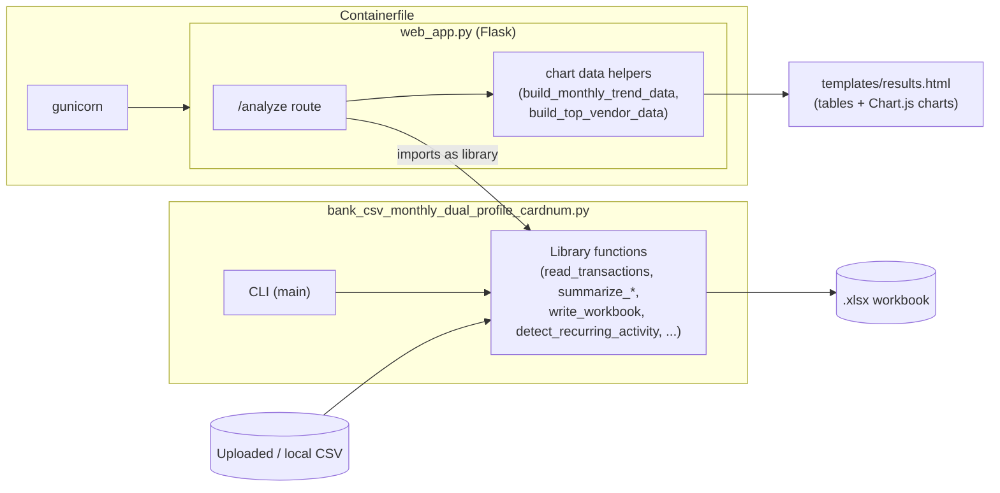

# Architecture

This document describes how bankanalyzer is put together: the module boundaries, the data flow through the system, the contracts that hold it together with no compiler or shared interface to enforce them, and the design decisions that aren't obvious from reading any single file. For usage instructions, see `README.md` and `USER_MANUAL.md`.

## System overview

Three deployable pieces share one core module:



`bank_csv_monthly_dual_profile_cardnum.py` is the only place that knows how to parse a CSV, normalize a vendor name, or aggregate transactions. Both the CLI (`main()`) and the web app (`web_app.py`, via `import bank_csv_monthly_dual_profile_cardnum as analyzer`) call into it — the web app never shells out to the CLI, and there is no separate "backend" module. The container just runs the web app under gunicorn.

## Core analyzer pipeline

Reading top to bottom, `bank_csv_monthly_dual_profile_cardnum.py` is one straight pipeline plus a recurring-activity side-analysis:

1. **`open_csv_with_fallback(input_csv)`** (line 72) — opens the file trying `utf-8-sig` → `utf-16` → `cp1252` → `latin-1` in order, returning the first encoding that parses. Bank exports are inconsistently encoded; this is why every entry point (CLI and web) can hand it an arbitrary uploaded file without pre-checking encoding.

2. **`parse_date(value)` / `parse_amount(value)`** (lines 116, 104) — normalize whatever the CSV cell contains into a `date` and a `Decimal`. `parse_amount` strips `$`/commas and treats parenthesized values (`(12.34)`) as negative — the common accounting convention for a charge shown as a reduction.

3. **`clean_vendor_name(description)`** (line 135) — the normalization heuristic that turns `GglPay PANERA BREAD PENSACOLA FL` into `PANERA BREAD`. It runs once per transaction row, so every regex and lookup table it uses is **pre-compiled at module level** (`_RE_SEPARATORS`, `_RE_PHONE_SPACE`, `_RE_DATE_SLASH`, `_RE_ALPHANUM_ID`, `_RE_STATE`, etc., lines 27–69) rather than constructed inside the function. The pipeline: strip separators → apply `_VENDOR_REPLACEMENTS` string substitutions (e.g. `WM SUPERCENTER → WAL MART`, `BILINTERNET → INTERNET` to merge Amex's truncated description with the direct one) → strip phone numbers / dates / alphanumeric IDs / state abbreviations → tokenize → drop `NOISE_WORDS` (payment-processor prefixes like `GGLPAY`, `APLPAY`, `PYPL`, `VENMO`, `ZELLE`, plus generic banking noise like `POS`, `ACH`, `AUTOPAY`) → keep the first 1–4 meaningful tokens → strip trailing `_LOCATION_WORDS`.

4. **`read_transactions(input_csv, date_col, text_col, debit_col, credit_col, card_col=None)`** (line 171) — ties the above together into a list of transaction dicts: `{date, month, description, vendor, card_number, debit, credit, net, row_number, row}`. `debit`/`credit`/`net` stay `Decimal` here and everywhere downstream until output.

5. **Summarization** — `summarize_by_month_vendor()` (line 352) groups by `(month, vendor, card_number)`; `summarize_month_totals()` (line 390) groups by `month` alone; `top_10_per_month()` (line 519) takes the month-vendor summary and ranks it. `write_workbook()` (line 670) calls `summarize_by_month_vendor()` exactly once and feeds the same result to both the *Monthly Grouped* sheet and `top_10_per_month()`, avoiding a second full pass over the transaction list.

6. **`detect_recurring_activity(transactions, min_occurrences=3)`** (line 444) — a separate analysis, not part of the main summarization chain. It groups by `(vendor, card_number)`, requires ≥3 transactions, then computes the coefficient of variation (stdev / mean) of both the day-gaps between transactions and the transaction amounts. A group counts as recurring only if the gap's CV is within `_RECURRING_INTERVAL_TOLERANCE` (0.35); the matched gap is classified against `_FREQUENCY_BANDS` (Weekly/Biweekly/Monthly/Quarterly/Annual by average day-gap range). Amount CV within `_FIXED_AMOUNT_TOLERANCE` (0.15) is labeled "Fixed Amount", otherwise "Variable Amount". Direction (`Income / Credit` vs `Expense / Charge`) comes from the sign of the summed `net`.

7. **`write_workbook(transactions, output_xlsx)`** (line 670) — produces the `.xlsx` with four sheets (*Monthly Totals*, *Monthly Grouped*, *Top 10 Per Month*, *Recurring Activity*), frozen header row, auto-filter. This is the **only place** (besides the web app's chart helpers, below) where `Decimal` gets cast to `float` — openpyxl needs native numeric types.

8. **`main()`** (line 711) — the CLI entry point: resolves column indices from the chosen `--profile` or explicit overrides, runs the pipeline, optionally writes a second filtered workbook and/or a subset CSV, and can print recurring activity / top-10 vendors to the console.

## CSV column profiles

The analyzer supports two column layouts, each with its own default column indices:

| Profile | date | description | debit/amount | credit |
|---------|------|-------------|---------------|--------|
| `bank` (default) | col 1 (B) | col 3 (D) | col 4 (E) | col 5 (F) |
| `credit-card` | col 0 (A) | col 1 (B) | col 4 (E) | none (sign-based) |

Bank profile: separate debit/credit columns, both always positive. Credit-card profile: one amount column, positive = charge, negative = payment. **These defaults exist in two places** — the CLI's `argparse` setup in `main()`, and a hardcoded `if profile == "credit-card": ... else: ...` block in `web_app.py`'s `analyze()` view — because the web app resolves columns from form fields rather than argv. There's no shared source of truth between them; a profile default change has to be made in both.

## Web app

`web_app.py` is a thin Flask layer with no persistence beyond the filesystem:

1. `/` renders the upload form (`templates/index.html`).
2. `POST /analyze` — saves the upload under a fresh `uuid4()` subdirectory of `UPLOAD_DIR` (so concurrent uploads never collide), resolves profile/column overrides from form fields, calls `analyzer.read_transactions()`, then `analyzer.write_workbook()` for the full dataset and again for a search/month-filtered subset if requested. It computes several view-model structures — `compute_summary`, `compute_top_patterns`, the two chart-data helpers below, plus `analyzer.summarize_month_totals`, `summarize_by_month_vendor`, `top_10_per_month`, `get_available_months`, `detect_recurring_activity` — and renders `templates/results.html`.
3. `/download/<analysis_id>/<filename>` — serves a generated file back, with both the `analysis_id` and `filename` path segments passed through `secure_filename()` before touching the filesystem, so an upload can't be used to read or write outside its own `UPLOAD_DIR` subdirectory.

### The `web_app.py` ↔ analyzer contract

`web_app.py` calls these analyzer functions directly, by name, with no interface or test enforcing the contract: `read_transactions`, `filter_transactions`, `write_workbook`, `summarize_month_totals`, `summarize_by_month_vendor`, `top_10_per_month`, `detect_recurring_activity`, `get_available_months`. **Changing any of their signatures or return shapes silently breaks the web UI** — there's no shared type definition, and `tests/` only exercises the analyzer module in isolation, never through `web_app.py`. This is the single biggest "spooky action at a distance" risk in the codebase; any change to one of these functions needs its `web_app.py` call site checked by hand.

### Chart data flow

The results page renders two Chart.js bar charts (monthly debit/credit/net trend, and top-10 vendors by spend) alongside the existing summary tables. Two functions in `web_app.py` reshape already-computed data for this:

- `build_monthly_trend_data(monthly_totals)` — maps `summarize_month_totals()`'s output to `{month, debit, credit, net}` with `Decimal → float` casts, one row per month, **not** scoped to any month filter (matching the "Monthly Totals" table it sits next to, which was never scoped either).
- `build_top_vendor_data(month_vendor_summary, selected_month=None, top_n=10)` — aggregates `summarize_by_month_vendor()`'s output by vendor, **scoped to `selected_month` when set** (matching how `compute_top_patterns` already behaves), sorted descending by total debit, top 10.

Both are the only place in `web_app.py` besides `compute_summary` where `Decimal` becomes `float` — done deliberately late, after all the summation happens in `Decimal`, to avoid float rounding drift in the totals. The resulting lists are passed to `templates/results.html` and injected into an inline `<script>` block via Jinja's `| tojson` filter (Flask's HTML-safe JSON encoder), which is what makes it safe to embed vendor names and descriptions that originated from an untrusted uploaded CSV directly into a `<script>` tag — `tojson` escapes `<`, `>`, `&`, and `'` so a vendor name like `</script>` can't break out of the script context. Chart.js itself loads from `cdn.jsdelivr.net`, pinned to major version 4, matching the existing (unpinned) `modern-normalize` CDN reference already used for CSS.

Because the two chart datasets are scoped differently, filtering to a month with no vendor spend can render the top-vendors chart's "not enough data" fallback while the monthly-trend chart above it still shows the full unfiltered year — this is intentional, not a bug, and the top-vendors chart's own heading names its scope (`"— {{ selected_month }}"` or `"— all months"`) so it doesn't read as contradicting the "per month" table beneath it.

## Data model

A transaction, once read, is a plain dict — there's no ORM or dataclass:

```python
{
    "row_number": int,
    "date": date,               # parsed, or None if unparseable
    "month": str,                # "YYYY-MM", derived from date
    "description": str,          # raw CSV text
    "vendor": str,                # clean_vendor_name(description)
    "card_number": str,           # "" if no --card-col given
    "debit": Decimal,
    "credit": Decimal,
    "net": Decimal,               # credit - debit
    "row": list,                  # original CSV row, for write_subset_csv
}
```

Every summarization function downstream (`summarize_month_totals`, `summarize_by_month_vendor`, `detect_recurring_activity`, `compute_summary`, `compute_top_patterns`, the chart helpers) consumes lists of this shape and produces its own aggregate dict shape (documented inline where each is defined). `Decimal` is the type of record for every amount until the two exit points that need native types: `write_workbook()` (Excel) and the two chart-data functions (JSON for Chart.js).

## Container / deployment

`Containerfile` builds from a `BASE_IMAGE` build arg (default `python:3.11-slim`), installs `requirements.txt`, copies the app in, and runs as a non-root `appuser`. `entrypoint.sh` creates `UPLOAD_DIR` and fixes its ownership before exec'ing the CMD (`gunicorn web_app:app --bind 0.0.0.0:5000 --workers 2 --threads 4 --timeout 120`).

Two constraints are deliberate, not oversights:

- **No OS packages installed in the image.** Rootless Podman/crun builds can fail when a package manager tries to make systemd/dbus calls with no user systemd session available. The base image is expected to already ship `ca-certificates` (the Debian-based default does; a UBI9 Python image is the documented RHEL9 alternative via `--build-arg BASE_IMAGE=...`).
- **No `HEALTHCHECK` directive.** Same root cause — rootless Podman can fail creating the systemd-based timer a `HEALTHCHECK` needs. Health checks are expected to be done externally (host-level, or CI).

`run.sh` wraps build-if-missing + run + browser-launch for local/WSL use, auto-detecting podman vs. docker.

## Testing boundary

`tests/test_bank_csv_monthly_dual_profile_cardnum.py` (unittest) covers only the core analyzer module — `parse_amount`, `parse_date`, `clean_vendor_name`, `safe_filename`, `detect_recurring_activity`, and friends. `web_app.py` has **no automated test coverage** by established convention; changes there are verified manually (running the dev server and exercising routes with `curl` or a browser). This means:

- A change to an analyzer function signature is caught by neither the analyzer tests (they test the old call shape) nor any web-layer test — see "The `web_app.py` ↔ analyzer contract" above.
- "Missing tests" is not a meaningful review finding for a `web_app.py`-only change unless the task explicitly asked for new coverage; it is a meaningful finding for an analyzer-module change without a corresponding case in `tests/`.

## Where to extend this

- **New CSV layout:** add a profile branch in both `main()`'s argparse defaults and `web_app.py`'s `analyze()` default-resolution block — see "CSV column profiles" above for why both need it.
- **New summarization/report:** add a `summarize_*` or `detect_*` function next to the existing ones in the core module, following the same "take a transaction list, return a list of dicts" shape, then wire it into `write_workbook()` (new sheet) and/or `web_app.py`'s `analyze()` (new view-model) as needed.
- **New vendor-normalization rule:** add to `_VENDOR_REPLACEMENTS`, `NOISE_WORDS`, or `_LOCATION_WORDS` at module level — never compile a new pattern inside `clean_vendor_name()` itself, since it runs per transaction row.
- **New web-page chart or view:** follow the existing chart-data pattern — a small pure function in `web_app.py` that reshapes already-computed summary data (casting `Decimal → float` only there), passed to the template and read via `| tojson` in an inline script, never via raw string interpolation.
